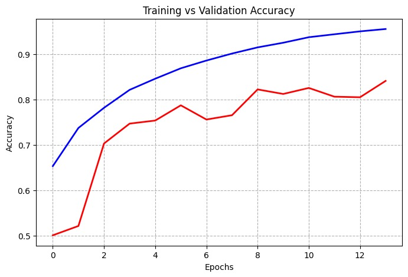
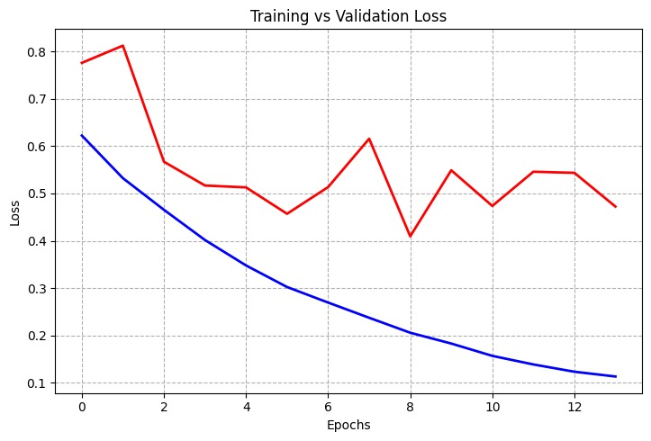

# 🐶🐱 Cat vs Dog Image Classifier using CNN (TensorFlow/Keras)

This project is a basic Convolutional Neural Network (CNN) model built to classify images of cats and dogs using TensorFlow and Keras. It was developed as a student project to practice deep learning, data preprocessing, and binary image classification tasks.

## 📁 Dataset

- Dataset used: [Dogs vs Cats (Kaggle)](https://www.kaggle.com/datasets/salader/dogs-vs-cats)
- Images are divided into `train/` and `test/` directories.
- Labels are inferred automatically from folder names.

> Note: You will need your Kaggle API key (`kaggle.json`) to download the dataset.

## 🧠 Model Architecture

The model is a simple CNN with:

- **3 Convolutional Layers**  
  - Filters: 32 → 64 → 128  
  - Activation: ReLU  
  - MaxPooling and BatchNormalization after each layer

- **Fully Connected Layers**  
  - Dense(128) → Dropout(0.1)  
  - Dense(64) → Dropout(0.1)  
  - Output layer: Dense(1), sigmoid activation

## ⚙️ Training Configuration

- Optimizer: `Adam`
- Loss: `BinaryCrossentropy`
- Epochs: `25`
- Batch Size: `32`
- Image Size: `256x256`
- Dataset normalized to range [0, 1]

## Model Performance

The CNN was trained for 25 epochs with early stopping based on validation loss.

| Epoch | Training Accuracy | Validation Accuracy | Training Loss | Validation Loss |
|-------|-------------------|---------------------|---------------|-----------------|
| 14    | 95.42%            | 84.13%              | 0.1122        | 0.4723          |

Final test accuracy achieved: **83.66%**

This shows the model is learning well and generalizes reasonably to unseen data.

### Accuracy



### Loss



> Note: These plots are generated using `matplotlib` during training.

## 🧪 Sample Prediction

To test the model on a custom image:

```python
import cv2
test_img = cv2.imread('/content/dog.jpg')
test_img = cv2.resize(test_img, (256, 256))
test_input = test_img.reshape((1, 256, 256, 3))
model.predict(test_input)
